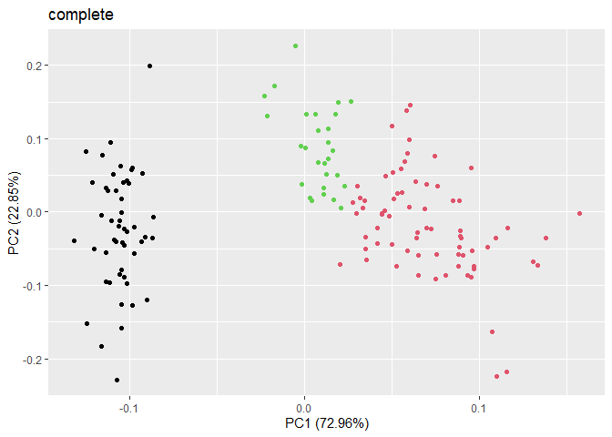

<!-- README.md is generated from README.Rmd. Please edit that file -->

# AHClassif

<!-- badges: start -->
<!-- badges: end -->

This package aims to create several ascending classification methods in
order to compare their performances on different datasets and to study
the causes of these differences.

A first so-called “naive” method will be introduced and described in
detail in order to achieve such a classification. In accordance with the
state of the art, we will introduce a second method (or even a third
one) in order to surpass the performances of the previously stated
method both in terms of time complexity and memory capacity, thus making
more accessible an ascending classification on large datasets.

The first tests will be performed on the well-known Iris dataset to
convince us of the efficiency of these algorithms.

## Installation

You can install the development version of AHClassif from
[GitHub](https://github.com/) with:

``` r
# install.packages("devtools")
devtools::install_github("Tmargate/AHClassif")
```

## Example

Here is a simple example on the Iris dataset using the “naive” method :

``` r
library(AHClassif)

methods = c("single","complete","average","weighted","centroid","median","Ward")
X = as.matrix(iris[-5])
iris.pca = prcomp(X,center=TRUE,scale.=TRUE)
table.dissim = list()

for (method in methods){
  P = AHC.dissim(X=X,method=method)
  P3 = P[150-length(levels(iris$Species))+1,]
  table.dissim[[method]] = table(P3,iris$Species)
  print(method)
  print(table.dissim[[method]])
  print(ggplot2::autoplot(iris.pca,data=iris,colour=P3)+ggplot2::ggtitle(method))
}
#> [1] "single"
#>    
#> P3  setosa versicolor virginica
#>   1     50          0         0
#>   2      0         50        48
#>   3      0          0         2
```


    #> [1] "complete"
    #>    
    #> P3  setosa versicolor virginica
    #>   1     50          0         0
    #>   2      0         23        49
    #>   3      0         27         1



    #> [1] "average"
    #>    
    #> P3  setosa versicolor virginica
    #>   1     50          0         0
    #>   2      0         50        38
    #>   3      0          0        12


    #> [1] "weighted"
    #>    
    #> P3  setosa versicolor virginica
    #>   1     50          0         0
    #>   2      0         35        49
    #>   3      0         15         1


    #> [1] "centroid"
    #>    
    #> P3  setosa versicolor virginica
    #>   1     50          0         0
    #>   2      0         50        14
    #>   3      0          0        36


    #> [1] "median"
    #>    
    #> P3  setosa versicolor virginica
    #>   1     50          0         0
    #>   2      0         50        37
    #>   3      0          0        13


    #> [1] "Ward"
    #>    
    #> P3  setosa versicolor virginica
    #>   1     50          0         0
    #>   2      0         49        15
    #>   3      0          1        35


``` r
print(ggplot2::autoplot(iris.pca,data=iris,colour="Species")+ggplot2::ggtitle("true species"))
```

 As the
package is under development, no conclusions can be drawn at this stage
of the evolution. A detailed report is attached in the directory to
detail all the methods used.
