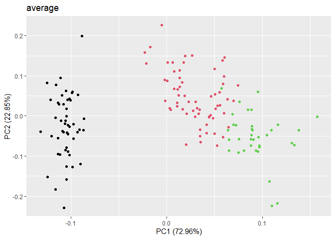

<!-- README.md is generated from README.Rmd. Please edit that file -->

# AHClassif

<!-- badges: start -->
<!-- badges: end -->

This package aims to create two ascending classification methods in
order to compare their performances on different datasets and to study
the causes of these differences.

A first so-called “classical” method will be introduced and described in
detail in order to achieve such a classification. In accordance with the
state of the art, we will introduce a second method in order to surpass
the performances of the previously stated method both in terms of time
complexity and memory capacity, thus making more accessible an ascending
classification on large datasets. Full details of these algorithms can
be found in the article in the repository (only available in French)

The first tests will be performed on the well-known Iris dataset to
convince us of the efficiency of these algorithms.

## Installation

You can install the development version of AHClassif from
[GitHub](https://github.com/) with:

``` r
install.packages("devtools")
devtools::install_github("Tmargate/AHClassif")
```

## Example

Here is a simple example on the Iris dataset using the classical
algorithm :

``` r
library(ggplot2)
#> Warning: le package 'ggplot2' a été compilé avec la version R 4.2.2
library(ggfortify)
#> Warning: le package 'ggfortify' a été compilé avec la version R 4.2.2
method = "average"
X <- as.matrix(iris[-5])
iris.pca <- prcomp(X,center=TRUE,scale.=TRUE)

res <- AHClassif::AHC_dissim(X=X,method=method)

P3 = res$P[150-length(levels(iris$Species))+1,]

print(table(P3,iris$Species))
#>    
#> P3  setosa versicolor virginica
#>   1     50          0         0
#>   2      0         50        14
#>   3      0          0        36
print(ggplot2::autoplot(iris.pca,data=iris,colour=P3)+ggplot2::ggtitle(method))
```



``` r
print(ggplot2::autoplot(iris.pca,data=iris,colour="Species")+ggplot2::ggtitle("true species"))
```

 Then with
the nearest neighbors chain algorithm

``` r
method = "average"
X <- as.matrix(iris[-5])
iris.pca <- prcomp(X,center=TRUE,scale.=TRUE)

res <- AHClassif::NNC_sim(X=X,method=method)

P3 = res$P[150-length(levels(iris$Species))+1,]

print(table(P3,iris$Species))
#>    
#> P3  setosa versicolor virginica
#>   1     50          0         0
#>   2      0         45         1
#>   3      0          5        49
print(ggplot2::autoplot(iris.pca,data=iris,colour=P3)+ggplot2::ggtitle(method))
```


``` r
print(ggplot2::autoplot(iris.pca,data=iris,colour="Species")+ggplot2::ggtitle("true species"))
```


## In the future

A C++ version of these algorithms would make them even more optimal in
terms of time complexity, which is what we are currently working on to
make this package even more useful on large datasets
